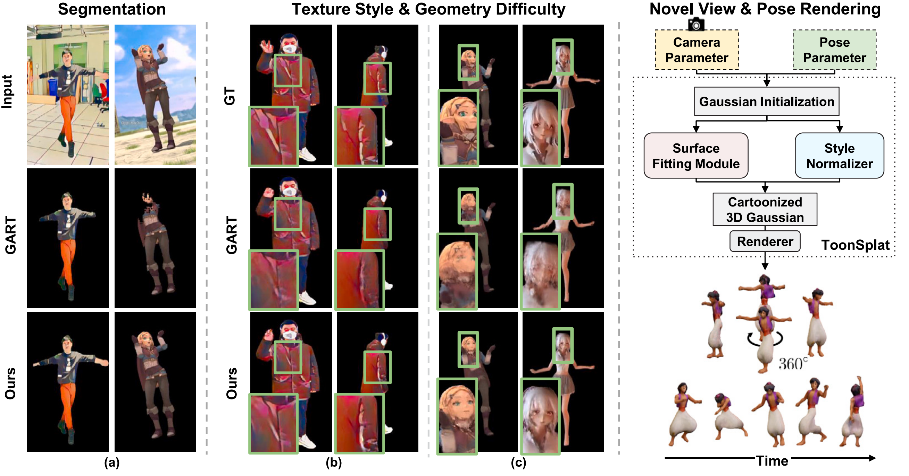

# ToonSplat: High-quality three-dimensional cartoon avatar reconstruction with Gaussian splatting


<!-- <p float="left">

</p> -->



Abstract: The growth of the augmented reality industry has increased demand for three-dimensional (3D) cartoon avatars, requiring expertise from computer graphics designers. Recent 3D Gaussian splatting methods have successfully reconstructed 3D avatars from videos, establishing them as a promising solution for this task. However, these methods primarily focus on real-world videos, limiting their effectiveness in the cartoon domain. In this paper, we present an artificial intelligence (AI)-based method for 3D avatar reconstruction from animated cartoon videos, addressing the physically unrealistic and unstructured geometries of cartoons, as well as the varying texture styles across frames. Our surface fitting module models the unstructured geometry of cartoon characters by integrating the surfaces observed from multiple views into a 3D avatar. We design a style normalizer that adjusts color distributions to reduce texture color inconsistencies in each frame of animated cartoons. Additionally, to better capture the simplified color distributions of cartoons, we design a frequency transform loss that focuses on low-frequency components. Our method significantly outperforms state-of-the-art methods, achieving approximately a 25\% improvement in Learned Perceptual Image Patch Similarity (LPIPS) with a score of 0.052 over baselines across the Cartoon Neuman and ToonVid datasets, which comprise 10 videos with diverse styles and poses. Consequently, this paper presents a promising solution to meet the growing demand for high-quality 3D cartoon avatar modeling.

<!--  -->

## Install

Our code is tested on Ubuntu 20.04 and cuda 11.8, you may have to change the following install script according to your system.
To install, run:

```bash
pip install -r requirements.txt
```

## Prepare Data

### Template Models and Poses

<details>
<summary>SMPL for human body</summary>

Download SMPL v1.1 `SMPL_python_v.1.1.0.zip` from the [SMPL official website](https://smpl.is.tue.mpg.de/download.php) and move and rename `SMPL_python_v.1.1.0/smpl/models/*.pkl` to `PROJECT_ROOT/data/smpl_model` So you can get:

```
PROJECT_ROOT/data/smpl_model
    ├── SMPL_FEMALE.pkl
    ├── SMPL_MALE.pkl
    ├── SMPL_NEUTRAL.pkl
```

</details>

### Cartoon Video Datasets

<details>
<summary>ToonVid Dataset</summary>

We provide ToonVid Dataset:

```
PROJECT_ROOT/data/ToonVid
    ├── 3d_girl_walk
    ├── AladdinDance
    ├── haku
    ├── zelda
```

</details>

<details>
<summary>Cartoon Neuman Dataset</summary>

You can download Neuman Dataset from the [Neuman official website](https://github.com/apple/ml-neuman) and you can cartoonize it in the CSC(Crayon Shin Chan) style using the [CTSS official website](https://github.com/XiangGao1102/CTSS). This way, you can obtain: 

```
PROJECT_ROOT/data/CartoonNeuman
    ├── Seattle
    ├── Citron
    ├── Parkinglot
    ├── Bike
    ├── Jogging
    ├── Lab
```

</details>

### Data Preprocess

To obtain the template body model, we follow the approach of [ScoreHMR](https://github.com/statho/ScoreHMR), and to obtain the GT surface normal, we follow the approach of [ECON](https://github.com/YuliangXiu/ECON).  

We provide a cartoon-specific character segmentation module to obtain pixel-wise segmentation masks for each video frame. 
To execute, run: 


```bash
cd Segmentation_Module
. ./make_seg_dataset.sh
```

## Fit Cartoons


To train and evaluate the model, run:

```shell
bash script/fit_eval_Toonsplat.sh
```


## Acknowledgement

Our code is based on several interesting and helpful projects:

- InstantAvatar: <https://github.com/tijiang13/InstantAvatar>
- GaussianSplatting: <https://github.com/graphdeco-inria/gaussian-splatting>
- Diff-gaussian-rasterization: <https://github.com/JonathonLuiten/diff-gaussian-rasterization>
- Text2Seg: <https://github.com/Douglas2Code/Text2Seg>
- Detectron2: <https://github.com/facebookresearch/detectron2>
- GART: <https://github.com/JiahuiLei/GART>


